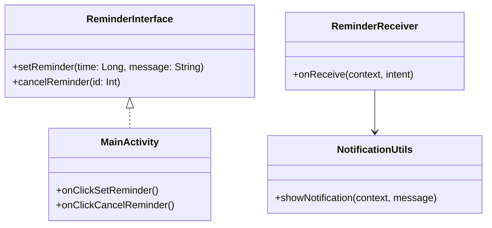

# ⏰ Simple Reminder App

🚀 A lightweight Android app built with **Kotlin** that allows users to set reminders using **AlarmManager**.  
When the set time arrives, the system triggers a **notification**, reminding the user of their task.  

---

## 🔧 Features
- 📅 Set one-time reminders easily  
- 🔔 Get notified at the scheduled time  
- ⚡ Uses **AlarmManager** for background scheduling  
- 🧩 Implements **Interface** for decoupled design & better testability  
- 🏗️ Follows **Clean Code** principles  

---

## 🛠️ Tech Stack
- **Kotlin** (Primary language)  
- **AlarmManager** (Scheduling & notifications)  
- **Interfaces** (Decoupled architecture)  
- **NotificationManager** (Push reminders)  
- **Android Studio + Gradle**  

---

## 📂 Project Structure

app/

├── MainActivity.kt # UI for setting reminders

├── ReminderInterface.kt # Interface for reminder actions

├── ReminderReceiver.kt # BroadcastReceiver to trigger notification

├── NotificationUtils.kt # Utility for notification building

└── res/

├── layout/activity_main.xml

└── drawable/

---

## 🧩 UML (Mermaid Diagram)

## sequenceDiagram
    participant User
    participant MainActivity
    participant AlarmManager
    participant ReminderReceiver
    participant NotificationUtils

    User->>MainActivity: Set Reminder
    MainActivity->>AlarmManager: Schedule Reminder
    AlarmManager-->>ReminderReceiver: Trigger at given time
    ReminderReceiver->>NotificationUtils: Build Notification
    NotificationUtils-->>User: Show Notification

 ##   💡 Key Learnings

✔️ Applied Interface for abstraction

✔️ Worked with AlarmManager & BroadcastReceiver

✔️ Improved understanding of Android background tasks

✔️ Practiced notification handling

## 📸 Screenshots 

